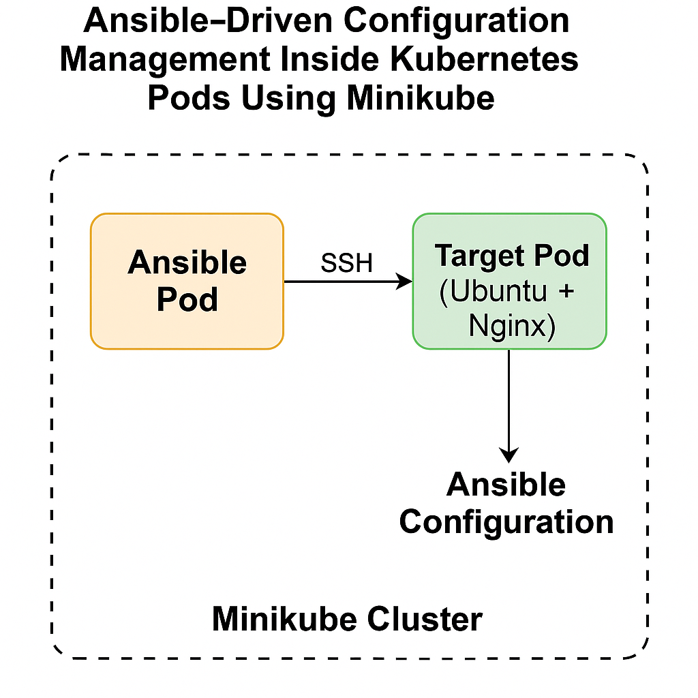
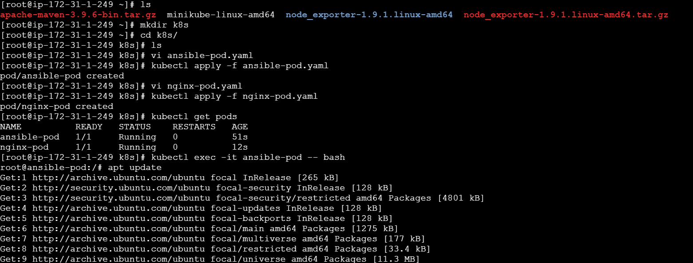
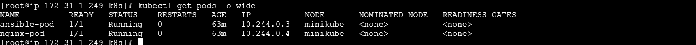
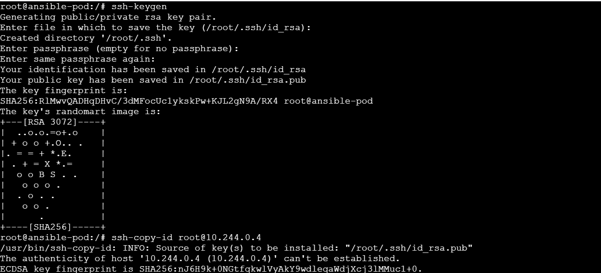
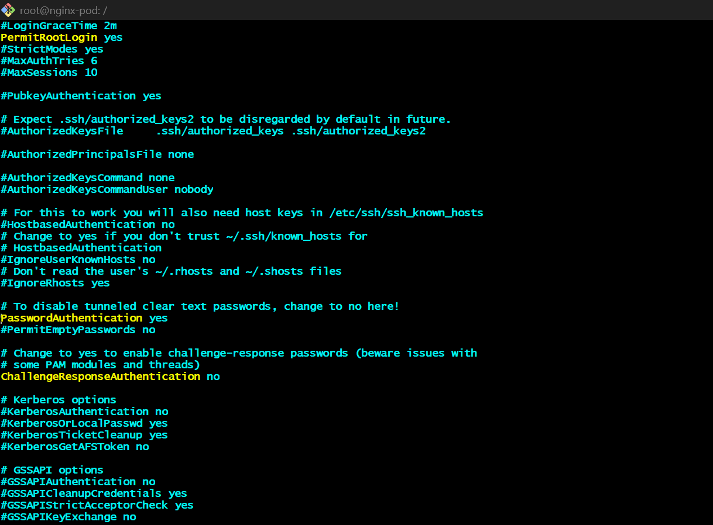
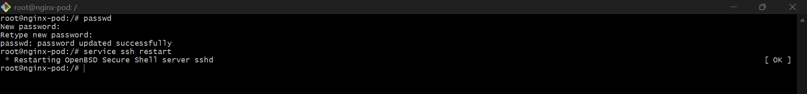
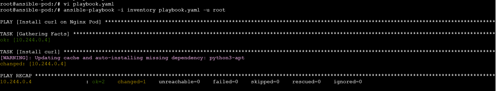
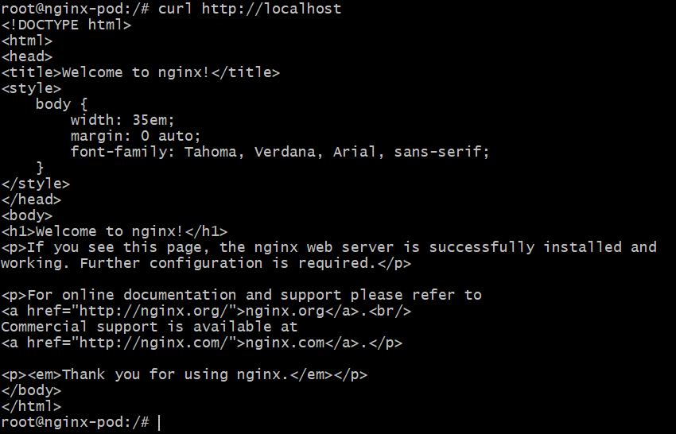

# 🛠️ Ansible-Driven Configuration Management Inside Kubernetes Pods Using Minikube

This project demonstrates how to run Ansible inside a Kubernetes pod to manage other pods using SSH — all within a **Minikube cluster**.

---

## 📸 Architecture Diagram



---

## 🚀 Project Overview

- **Minikube** is used to create a local single-node Kubernetes cluster.
- Two pods are deployed:
  - 🟡 **Ansible Pod** — acts as the control node
  - 🟢 **Target Pod** (Ubuntu + Nginx + SSH)
- SSH key-based authentication is set up between the pods.
- Ansible is installed inside the Ansible pod and used to manage the target pod.

---

## 🧰 Prerequisites

- Minikube installed (`minikube start`)
- `kubectl` configured to talk to Minikube
- Basic Linux, Ansible & Kubernetes knowledge

---

## 📦 Folder Structure
```
.
├── ansible-pod.yaml
├── nginx-pod.yaml
├── inventory.ini
├── playbook.yml
└── images/
```
---

## 🧱 Step-by-Step Setup

### 🔹 Step 1: Start Minikube

```bash
minikube start
```
🔹 Step 2: Deploy the Ansible Pod
```bash
kubectl apply -f ansible-pod.yaml
```
🔹 Step 3: Deploy the Target Pod with SSH & Nginx
```bash
kubectl apply -f nginx-pod.yaml
```
 

🔹 Step 4: Setup SSH Between Pods
- kubectl exec -it ansible-pod -- bash
- Generate SSH key:
  ```bash
  ssh-keygen
  ```
- Copy public key to nginx pod:
  ```bash
  ssh-copy-id user@<nginx-pod-ip>
  ```
  
  

- Inside the Nginx Pod:
    - kubectl exec -it nginx-pod -- bash
```bash
apt install vim
vi /etc/ssh/sshd_config
#inside this 
PermitRootLogin yes
PasswordAuthentication Yes
```


- last step
```bash
passwd    # Set a root password like root123
service ssh restart
```
 

 🔹 Step 5: Install Ansible Inside Pod 
 ```bash
 apt update
 apt install -y python3-pip ssh
 pip3 install ansible
```
🔹 Step 6: Run Playbook
inventory.ini
```bash
[target]
<nginx-pod-ip> ansible_user=root ansible_ssh_private_key_file=~/.ssh/id_rsa
```
```bash
ansible-playbook -i inventory.ini playbook.yml
```


Final step
- Check curl command install in target node or not(nginx-pod)



